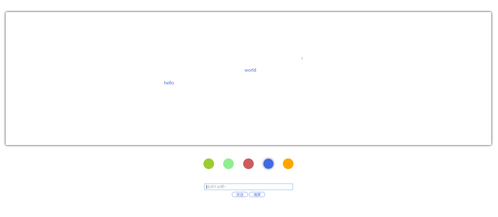

# Bullet screen

> 一个弹幕墙demo（来自FreeCodeCamp的作业），支持发送弹幕、更改弹幕颜色、清屏。

* 截图：

* [DEMO页](http://htmlpreview.github.io/?https://github.com/whxru/JS-Learning/blob/master/Bullet%20screen/index.html)
* Q: 用`span`包裹弹幕内容插入为screen的首位子节点，通过CSS Animation控制弹幕的移动，问题在于如何监测弹幕的状态（飞行中or飞行完毕）以供删除多余节点和清屏之用。
  - [ ] 使用[MutaionObserver](https://developer.mozilla.org/zh-CN/docs/Web/API/MutationObserver)监测每个弹幕`style`的变化？（兼容性需要IE11及以上，多条弹幕时的性能？）
  - [ ] 使用`setTimeout()`来在固定的时间（动画持续时间）后删除子节点以及从“正在飞行弹幕数组”中删除大幕？（时间精准度？多条弹幕时的性能？动画时间带来的可扩展性问题？）
  - [ ] 使用`setInterval()`配合对`xx.style.right`的监测来定时清理子节点以及“正在飞行弹幕数组”？（时间精准度？动画时间带来的可扩展性问题？）
  - [x] 使用`Animation Event` 中的`animationend`事件（兼容性需要IE10及以上，多条弹幕时的性能？）似乎更加“符合情理”，故暂先采用此种方案。

